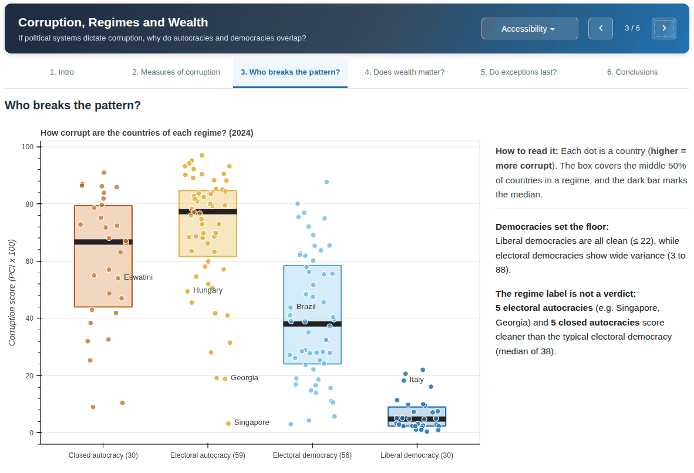
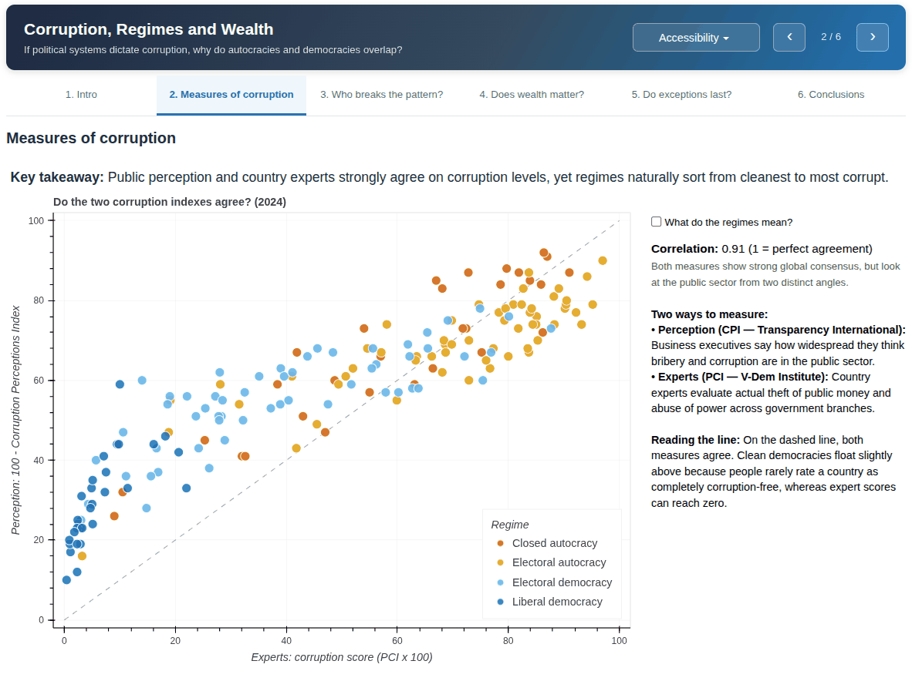
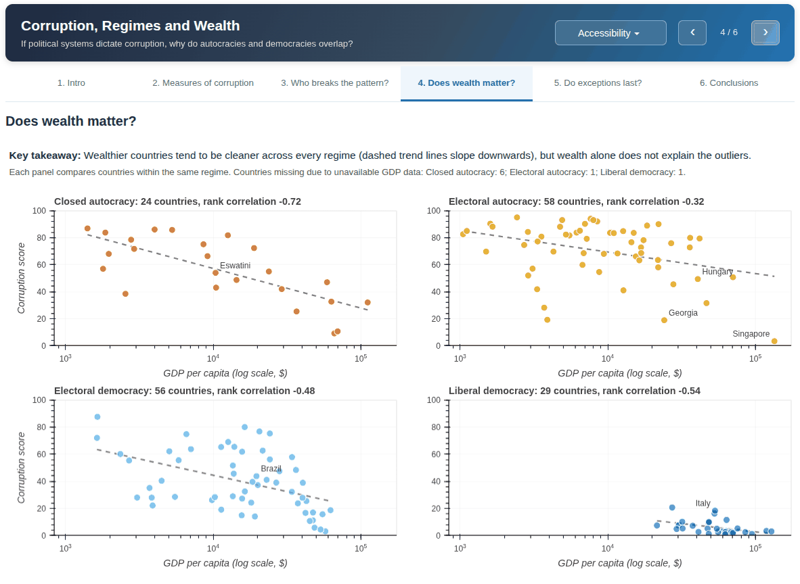
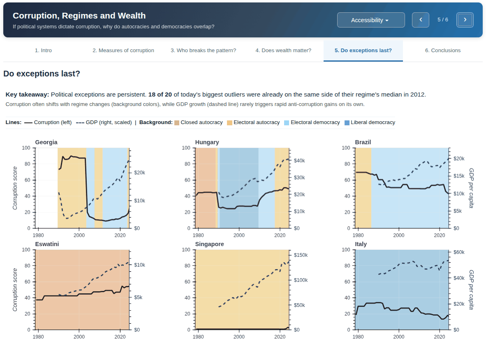
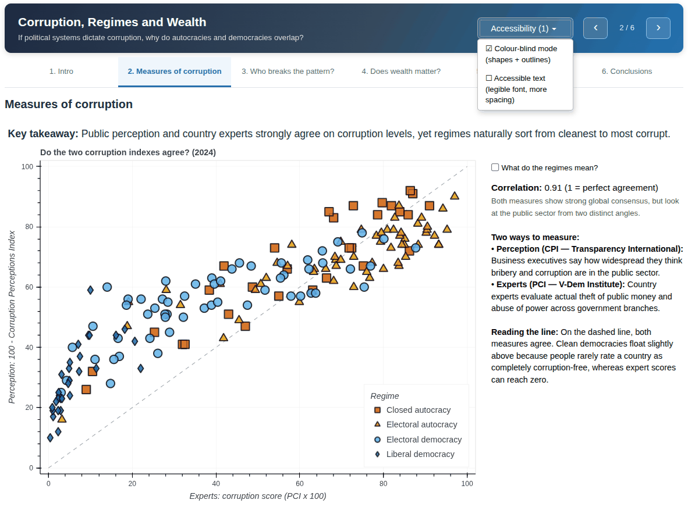

# Corruption, Regimes and Wealth

**If political systems dictate corruption, why do autocracies and democracies overlap?**


An interactive, six-slide data story built with [Bokeh](https://bokeh.org/) on 175 countries (2024). It compares two ways of measuring corruption, shows how much corruption varies *inside* each political regime, and tests whether wealth and history explain the exceptions.



## Preview

**Two ways to measure corruption.** Perception (CPI) and expert assessment (PCI) agree closely (r = 0.91).



**Does wealth matter?** One panel per regime: richer countries tend to be cleaner, but wealth does not explain the outliers.



**Do exceptions last?** Corruption (solid line) and GDP (dashed line) since 1979, with regime changes as background colours.



**Accessibility.** A colour-blind mode (one marker shape per regime plus dark outlines) and an accessible-text mode are available from the header menu.



## Key findings

| # | Finding | Evidence |
|---|---|---|
| 1 | **Perception and expert measures agree** | Transparency International's CPI (perception) and V-Dem's PCI (experts) correlate at **r = 0.91** across countries. |
| 2 | **The regime sets the typical level** | Median corruption score (0 = clean, 100 = most corrupt): liberal democracies **5**, electoral democracies **38**, closed autocracies **67**, electoral autocracies **77**. |
| 3 | **Regimes overlap a lot** | **32 of 175 countries** sit more than 25 points away from their own regime's median. 5 electoral and 5 closed autocracies are cleaner than the median electoral democracy (e.g. Singapore, Georgia). |
| 4 | **Wealth helps, but does not explain everything** | Within every regime, richer countries tend to be cleaner (Spearman rank correlation between **-0.32** and **-0.72**). |
| 5 | **Exceptions last** | **18 of the 20** biggest outliers of 2024 were already on the same side of their regime's median in 2012. |

The numbers are computed by the app from the dataset, so they stay in sync if the data is regenerated.

## Run it locally

```bash
git clone git@github.com:Roaldvdb/corruption-regimes-wealth.git
cd corruption-regimes-wealth

python -m venv .venv
source .venv/bin/activate        # Windows: .venv\Scripts\activate
pip install -r requirements.txt

bokeh serve --show app
```

The app opens at <http://localhost:5006/app>. Python 3.10 or later is recommended.

**Accessibility menu** (top right): colour-blind mode (one marker shape per regime plus dark outlines) and an accessible-text mode (legible font, more spacing).

## Project structure

```
.
├── app/
│   └── main.py                         # Bokeh server app (6 slides)
├── data/
│   └── master_governance_dataset.csv   # final panel dataset used by the app
├── docs/                               # screenshots used in this README
├── notebooks/
│   ├── 1_download_data.ipynb           # downloads the raw indicators from OWID
│   └── 2_create_dataset.ipynb          # cleans, aligns and merges them
├── requirements.txt
└── README.md
```

## Data

All indicators come from [Our World in Data](https://ourworldindata.org/), which republishes the original sources. Please cite the original providers when reusing the data.

| Variable | Original source | Scale | Years |
|---|---|---|---|
| `CPI` | Transparency International, Corruption Perceptions Index | 0-100, higher = cleaner | 2012-2024 |
| `PCI` | V-Dem, Political Corruption Index | 0-1, higher = more corrupt | 1789-2025 |
| `GDP_pc` | World Bank, GDP per capita (PPP, constant international $) | $ | 1990-2025 |
| `regime_label` | V-Dem, Regimes of the World | closed autocracy, electoral autocracy, electoral democracy, liberal democracy | 1789-2025 |

The dataset has one row per country and year (26,674 rows, 8 columns) covering 1789-2025. The app itself uses 2024 for the main charts, 2012 for the persistence check and 1979 onward for the time series; the earlier years are kept for the long history. `code` (ISO-3) is the join key between the sources and is not read by the app. The full data dictionary is at the end of `notebooks/2_create_dataset.ipynb`.

To rebuild the dataset from scratch, run the two notebooks in order. The OWID URLs always serve the latest release, so the numbers may differ slightly from the committed snapshot.

## Method notes

- Every score in the app follows one rule: **higher = more corrupt**. CPI is flipped (100 - CPI) for the comparison on slide 2.
- "Exception" = distance between a country's corruption score and the median of its own regime. "Persistent" = the same sign of that distance in 2012 and 2024.
- Regimes are V-Dem's *Regimes of the World* classification.

## Limitations

- **PCI is a step-like expert estimate.** Its year-to-year change is exactly zero in about 95 % of cases before 1900, 86 % in 1900-1989 and 53 % from 1990. Older values are mostly carried forward.
- **CPI measures perception and PCI measures expert assessment.** They agree broadly, not country by country.
- **GDP gaps are not random.** Cuba, North Korea, Eritrea, Venezuela, Taiwan, South Sudan and Yemen have no GDP, so slide 4 under-represents closed regimes.
- **Different time windows.** CPI covers 2012-2024 and GDP starts in 1990. Compare indicators on common years only.
- **Association, not causation.** The analysis is descriptive.
- **PCI is the backbone of the merge**, so entities missing from V-Dem are dropped (notebook 2 prints the list).

## Tech stack

Python, pandas, NumPy, Bokeh (server app with Python callbacks and a few `CustomJS` interactions).

## License

<!-- Add a LICENSE file (e.g. MIT for the code) and state it here. Data licenses remain those of the original providers. -->
